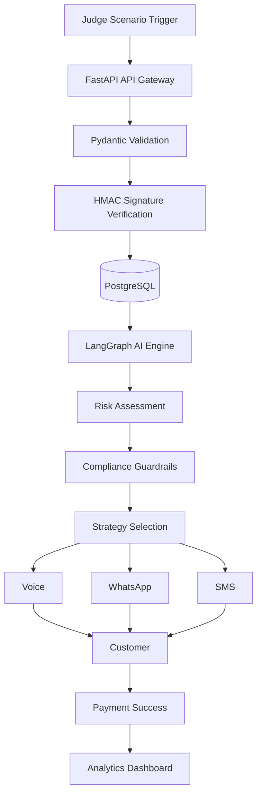

# ⚡ RecovAI – Autonomous Multi-Agent Revenue Recovery Platform

**AI Buildathon 2026 Submission**

RecovAI is an AI-powered autonomous revenue recovery platform that helps SaaS businesses recover lost subscription revenue caused by failed payments, expired cards, insufficient funds, and billing disputes. The platform combines AI-driven decision making with deterministic compliance guardrails to automate revenue recovery while ensuring security, transparency, and regulatory compliance.

---

## 📌 Problem Statement

Subscription-based businesses lose a significant portion of their Annual Recurring Revenue (ARR) due to payment failures. Traditional recovery systems rely on repetitive email reminders with poor engagement and often fail to distinguish between genuine payment failures and sensitive situations such as active billing disputes.

RecovAI transforms this process by intelligently analyzing failed payments, selecting the optimal recovery strategy, and executing compliant multi-channel outreach while maintaining complete explainability of every AI decision.

---

# ✨ Key Features

- 🤖 AI-powered multi-agent recovery workflow using LangGraph
- 📊 Glass-Box AI Explainability Engine
- 🛡️ Deterministic compliance guardrails (Rule R-102)
- 💳 Secure Razorpay webhook verification using HMAC SHA-256
- 📞 Multi-channel customer outreach (Voice, WhatsApp, SMS)
- 📈 Real-time business analytics and recovery dashboards
- 🔍 48-hour proactive card expiration scanner
- 📡 Live infrastructure telemetry and health monitoring
- 📑 Interactive Swagger API documentation

---

# 🛠 Tech Stack

### Frontend
- React.js
- TypeScript
- Tailwind CSS

### Backend
- FastAPI
- PostgreSQL
- Redis

### AI
- LangGraph
- Gemini 2.5 Flash

### Integrations
- Razorpay Webhooks
- Twilio SMS
- Retell AI Voice

---

# 🏗️ System Architecture



---

# 📊 Workflow

1. Judge selects a payment failure scenario.
2. FastAPI receives and validates the request.
3. HMAC verifies webhook authenticity.
4. Payment event is stored in PostgreSQL.
5. LangGraph AI evaluates customer risk.
6. Compliance guardrails enforce business policies.
7. Best recovery strategy is selected.
8. Personalized outreach is sent.
9. Dashboard updates with recovery analytics.

---

# 📷 Project Screenshots

### Dashboard

> Add dashboard screenshot here

### AI Explainability Engine

> Add explainability screenshot here

### How RecovAI Works

> Add workflow screenshot here

### Swagger API

> Add Swagger screenshot here

---

# 📂 Project Structure

```
RecovAI
│
├── backend
│   ├── api
│   ├── services
│   ├── models
│   ├── routers
│   └── database
│
├── frontend
│   ├── components
│   ├── pages
│   ├── hooks
│   └── assets
│
├── docker-compose.yml
├── requirements.txt
└── README.md
```

---

# 🚀 Getting Started

## Clone Repository

```bash
git clone https://github.com/your-username/RecovAI.git

cd RecovAI
```

## Backend

```bash
cd backend

pip install -r requirements.txt

uvicorn app.main:app --reload
```

Backend runs at

```
http://localhost:8000
```

Swagger Documentation

```
http://localhost:8000/docs
```

---

## Frontend

```bash
cd frontend

npm install

npm run dev
```

Frontend runs at

```
http://localhost:5173
```

---

# 📈 Core Modules

- AI Revenue Recovery Engine
- LangGraph Multi-Agent Workflow
- Compliance Guardrail Engine
- AI Explainability Dashboard
- Multi-Channel Outreach
- Recovery Analytics
- Infrastructure Telemetry
- Webhook Security Engine
- Proactive Payment Scanner

---

# 🔒 Security Features

- HMAC SHA-256 Webhook Verification
- Pydantic Request Validation
- CORS Protection
- Deterministic Compliance Guardrails
- Secure API Design

---

# 📚 API Endpoints

| Endpoint | Description |
|----------|-------------|
| `/docs` | Swagger Documentation |
| `/health` | System Health Check |
| `/analytics` | Dashboard Analytics |
| `/simulate` | Trigger Payment Failure |
| `/explainability` | AI Decision Trace |
| `/webhook` | Razorpay Webhook |
| `/outreach` | Customer Outreach |

---

# 🚀 Future Enhancements

- Kubernetes Deployment
- OAuth Authentication
- Multi-Tenant SaaS Support
- Real-Time Streaming Analytics
- Predictive Churn Forecasting
- A/B Testing for Recovery Strategies
- Multi-Language Voice Personalization

---

# Author
*Subiksha Rajasekaran*
B.Tech Computer Science (AI & Data Science)
SASTRA Deemed University

---
